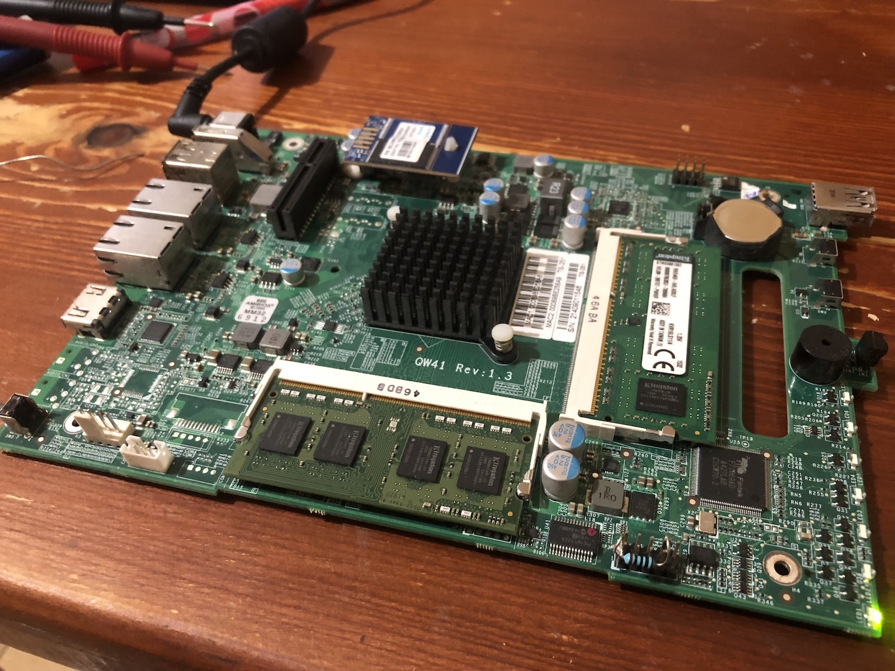
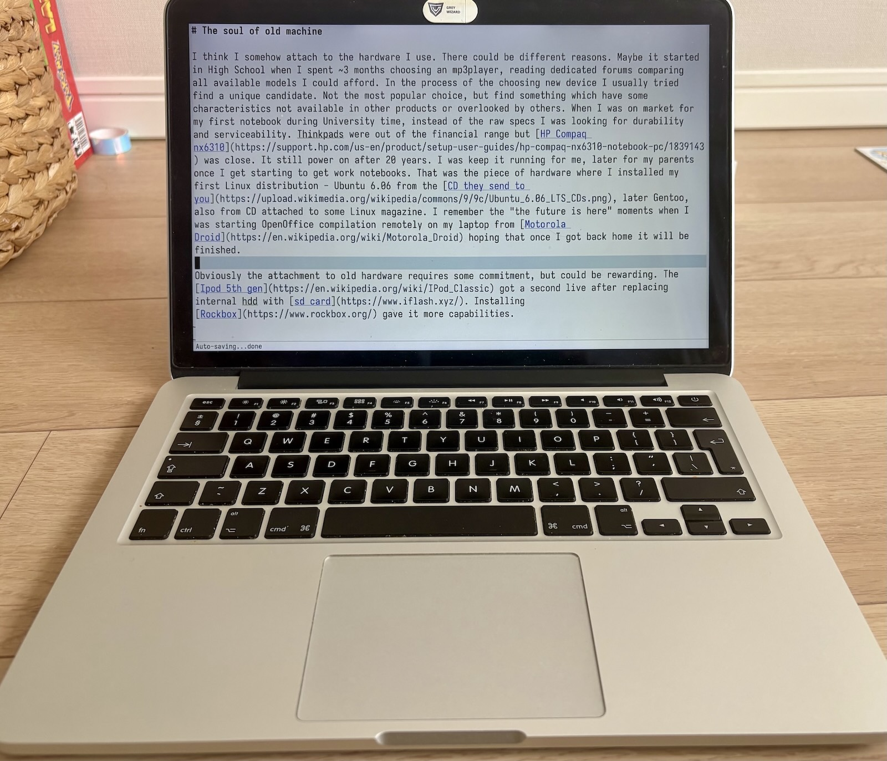
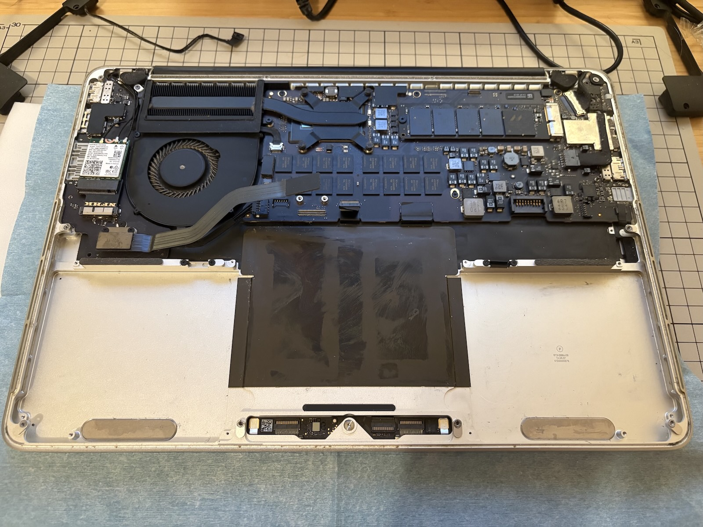

+++
title = "The soul of an old machine"
date = 2026-04-06
+++

I somehow get attached to the hardware I use. I think it started in high school when I spent ~3 months choosing an MP3 player, reading dedicated forums and comparing all available models I could afford. After a tedious process I used it for years, probably longer than I was supposed to, falling behind trends. That pattern stuck. In the process of choosing a new device I usually tried to find a unique candidate. Not the most popular choice, but something that had characteristics not available in other products.

When I was on the market for my first notebook during my university years, instead of the raw specs I was looking for durability and serviceability. ThinkPads were out of my financial range but [HP Compaq nx6310](https://support.hp.com/us-en/product/setup-user-guides/hp-compaq-nx6310-notebook-pc/1839143) was close. It still powers on after 20 years. I kept it running for me, later for my parents once I started getting work notebooks. That was the piece of hardware where I installed my first Linux distribution - Ubuntu 6.06 from the [CD they sent to you](https://upload.wikimedia.org/wikipedia/commons/9/9c/Ubuntu_6.06_LTS_CDs.png), later Gentoo, also from a CD attached to some Linux magazine. I remember the "the future is here" moment, holding a [Motorola Droid](https://en.wikipedia.org/wiki/Motorola_Droid) and starting an OpenOffice compilation remotely on my laptop, hoping that once I got back home it would be finished. A lot of activities and hobbies happened around and through these devices, and it was the pre-social network era.

The attachment to old hardware requires some commitment, especially if the device wasn't built to last. If it was popular enough there is a chance to find a community around it which concentrates on keeping it alive and improving it, and it can be a rewarding process. The [iPod 5th gen](https://en.wikipedia.org/wiki/IPod_Classic) got a second life after replacing internal hdd with [sd card](https://www.iflash.xyz/) and a fresh, bigger battery. Installing [Rockbox](https://www.rockbox.org/) gave it more capabilities. Sometimes it is more of a necessity to keep something alive. A couple of hours before my flight to a new country where I started a new chapter in my life I sat in my parents' kitchen and soldered an extra resistor to the motherboard of the NAS I wanted to leave for them. That was the best moment for [LPC clock degradation issue with the Intel Celeron J1900](https://wiki.jmehan.com/pages/viewpage.action?pageId=44695614) to emerge.



In 2014 I received a [MacBook Pro, 13-inch Late 2013](https://support.apple.com/en-us/111946) at my new work place. That wasn't the first encounter with Apple products though. At the end of elementary school our newly opened computer lab was equipped with lovely [iMac G3s](https://en.wikipedia.org/wiki/IMac_G3), which were all stolen after a few months. To this day I remember the Monday morning at school finding out what happened and stepping on some keys from keyboards lying around in the corridor. Hmm, so maybe that's when I started getting attached to hardware? Anyway, after a few days I got used to the new notebook and enjoyed it. At that time I was impressed by the operating system, the look and the quality of the apps. The fact that I could attend online meetings, share the screen without worrying what might not work this time and had access to a Unix shell and familiar programs was a new world for me.

The thrill faded over the years, especially in terms of look and user experience. These days, if possible, I am using [sway](https://swaywm.org/) tiling window manager with basic config. The keyboard driven workflow is in my muscle memory, and my fingers like to stay on the keys of [hhkb](https://en.wikipedia.org/wiki/Happy_Hacking_Keyboard), another device which stays with me. Yet the hardware part of the MacBook remains relevant even after all those years. Sure, the CPU shows its age, which you can feel when browsing the modern internet, but only in 2024 when I bought a 4K monitor, the limitations of Intel Iris Graphics became more obvious. It couldn't drive it at native resolution at 60Hz. That being said, the screen of this notebook is its most appealing part. It was one of the first models with a Retina display. I often looked at used ThinkPads, which have much better serviceability and support under Linux. But the resolution and colors of the screen on the device I already had kept me from buying one. The keyboard is OK, assembled before all the [dramas](https://appleinsider.com/articles/24/11/19/apple-has-officially-ended-its-butterfly-keyboard-repair-problem-for-macbooks). The aluminum body remains strong and solid. The trackpad is top-notch.

When I was changing employers, I bought it out and took it with me. The official support ended on Big Sur release. It could be pushed further with [OpenCore](https://dortania.github.io/OpenCore-Legacy-Patcher/START.html) but nowadays I only use macOS on it to run pre-cloud Lightroom and [negative lab pro](https://www.negativelabpro.com/) to "develop" some of my [film scans](https://www.flickr.com/photos/michalskalski/albums/72157713114804282/). I'm running [NixOS](https://github.com/NixOS/nixos-hardware/tree/master/apple/macbook-pro/11-1) on it most of the time, without any hardware support issues. Maybe sometimes the red light from the S/PDIF digital output becomes visible. It's a twelve-year-old machine, but it rarely feels like one. Emacs with rust-analyzer/gopls works fine for smaller projects locally. For those projects which benefit from better specs I can use it to remotely attach to my desktop. Websites like Reddit or YouTube tend to spin up the fan, a reminder of the actual age. I guess it has become more of a [writer deck](https://www.reddit.com/r/writerDeck/), a distraction-free machine for writing and focused work.



I recently updated my Nix flake for this MacBook to use NixOS 25.11 channel and my config could no longer build. The reason was that `broadcom_sta` driver was marked [as insecure](https://github.com/NixOS/nixpkgs/pull/421163) due to known, unresolved CVE issues. Combining this with the already existing lack of WPA3 support, I started looking into alternatives. The problem, as often with Apple hardware, is that they use a proprietary connector instead of a standard M.2. After some searching, I found an adapter on AliExpress described as "WIFI 6 AX200 AX210 adapter for MacBook Pro A1502 A1398". I ordered it together with an Intel AX210 card which has good support under Linux through the `iwlwifi` driver. When the parts arrived, I opened the case and found an unpleasant surprise. The battery showed signs of swelling.



It wasn't the original battery. I had replaced it in May 2023 with [ifixit kit](https://www.ifixit.com/Guide/MacBook+Pro+13-Inch+Retina+Display+Late+2013+Battery+Replacement/27316) because of the same symptoms. This time I couldn't order the same as they don't send batteries to Japan, so I found a kit on local Amazon. After replacing all the components, I had an issue with initializing the new Wi-Fi card during boot, but not always. I quickly connected the dots that it only happened when the computer was on battery power, and commented out the following in my [TLP config](https://linrunner.de/tlp/settings/runtimepm.html#pcie-aspm-on-ac-bat):

```
PCIE_ASPM_ON_BAT= "powersupersave"
```

I probably gained another year with this machine. It traveled with me through three continents and lasted longer than the manufacturer envisioned, I think. Last year I replaced my iPhone 8 with a 16, mainly because security updates weren't provided anymore, but I hardly found a feature to be excited about. No "the future is here" moment this time. Most devices today follow the same shape and the same cycle. That makes it worth searching for the ones with some soul to them, the ones built to last. Recently, ThinkPads seem to be [going back](https://www.ifixit.com/News/115827/new-thinkpads-score-perfect-10-repairability) to their easy serviceability roots, and the Framework laptops continue to prove that there is a market for devices like that.
