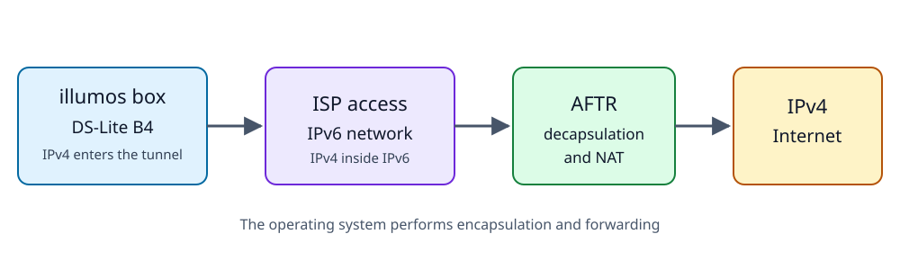

+++
title = "Connecting my illumos box to a Japanese ISP"
date = 2026-08-09
+++

_Update (2026-09-06): This article had 3 version. The first one, never published, I asked an LLM to rewrite to be easier to follow  by the external reader and that was the initial version published here. It still can be seen in the [repository](https://github.com/michalskalski/skalskidev/blob/13592d0c9f0f059db78f3dec7c01bfdbca6a7a05/content/2026-08-09_connecting_my_illumos_box_to_a_japanese_isp/index.md). I decided to rewrite it again while still have a fresh memory on this topic, this time using my own words. I would like to feel more connection with what I publish here._

When I was moving I chose to do it light, one suitcase per person and only few boxes sent on multi-month trip on the ship (mainly books for my kid). The things I couldn't give away, sell or throw away landed at my parents' house and that included my home server. When I had a chance to visit my family home, I took out the motherboard ([X10SDV-6C-TLN4F](https://www.supermicro.com/en/products/motherboard/x10sdv-6c-tln4f)), RAM sticks and a pair of SDD disks from the server and "smuggled" them back with me.

Once assembled server again I decided to install OmniOS on it. I wanted to go back to illumos based systems because in the past I had fun with SmartOS which the need of using Linux VFIO GPU pass through ended. This time I was more focused on the networking side as the motherboard was equipped with a dual port 10Gbase NIC which I wanted to use directly connecting to the modem provided by the ISP.

Speaking of the ISP, I was surprised how many companies were hidden behind it. In my case the physical access runs over NTT's FLET'S network. My retail contract for that line is Docomo Hikari, while ASAHI Net provides Internet connectivity on top of it. To find out about the network setup I used materials from all the parties. I started safely by connecting the ISP modem to my own router with OpenWrt installed. Took some notes what configuration looked like and the community posts were a real treasure to build an understanding of the specifics of the [IPv6 transition mechanisms](https://en.wikipedia.org/wiki/List_of_IPv6_transition_mechanisms) widely used in Japan.

In the case of my connection the DS-Lite mechanism was used which is described by [RFC 6333](https://www.rfc-editor.org/rfc/rfc6333). The short version is that the customer side component (called a B4) takes an IPv4 packet and wraps it inside an IPv6 packet addressed to an ISP endpoint called the AFTR. Once the AFTR receive it, it removes the outer packet and forwards the inner IPv4 packet to IPv4 endpoint doing NAT on the way.



On OmniOS I first tried to establish if I could set up similar link to what I saw on the router. The Linux computer in my network acted temporarily as an AFTR side and on OmniOS I crated a `iptun` interfaces with remote endpoint pointing to the mocked ISP part. That worked and I could pass IPv4 packets through it. And here I probably could end this, wrap it in some scripts and call it a day. Maybe not exactly, there is also the part where you need to discover the AFTR address. The [RFC 6334](https://www.rfc-editor.org/rfc/rfc6334) defines DHCPv6 option 64 for this purpose. Turned out it is not the only mechanism, some Japanese ISPs agreed on using a provisioning protocol called [HB46PP](https://github.com/v6pc/v6mig-prov/blob/9020a1bd5f2f8f83712b1180db70af7dc0dad638/spec.md). When in use, like in case of my ISP, a client resolves a TXT record at `4over6.info` using provider supplied DNS. The value includes a URL and trust mode of a provisioning service which the client can use to fetch information about available IPv4 over IPv6 methods and details needed to use them.

My other motivation was to learn more about the illumos network stack. Some time ago I read an article by Ryan Goodfellow about [the life of an IPv6 address on illumos](https://ry.goodwu.net/tinkering/a-day-in-the-life-of-an-ipv6-address-on-illumos/) and wanted my own journey with the problems to solve on the way... and I got what I wanted. Started writing a Rust daemon which would handle the life cycle of connection to my ISP. I did not use shell out to commands like `dladm`, `ipadm` or `ip` (yeah, I decided to support Linux too) but rather depended on [rtnetlink](https://docs.rs/rtnetlink/latest/rtnetlink/) on the Linux part and libc and FFI for illumos support.

I got stuck for a while when I encountered problem with getting `IPADM_NOTSUP` when I tried to assign an local IPv4 address to the link, something with which `ipadm create-addr` had no issue. Multiple `truss`, `DTrace` and `mdb` calls later, after questioning my ability to properly translate C structures and with help of an internet search and LLM interpretation the cause was finally known. I was using `/lib/amd64/libipadm.so.1`:

```
$ file /lib/amd64/libipadm.so.1
/lib/amd64/libipadm.so.1:       ELF 64-bit LSB dynamic lib AMD64 Version 1, dynamically linked, not stripped, no debugging information available
```

to communicate with `/lib/inet/ipmgmtd`:

```
$ file /lib/inet/ipmgmtd
/lib/inet/ipmgmtd:      ELF 32-bit LSB executable 80386 Version 1, dynamically linked, not stripped, no debugging information available
```

through an [illumos door](https://man.omnios.org/man3c/door_call), a local procedure call mechanism. One of the [private door request structures](https://github.com/illumos/illumos-gate/blob/0764e87f4a667f36d63262fcdd690064929acc48/usr/src/lib/libipadm/common/ipadm_ipmgmt.h#L235-L241) contains a `size_t` field followed by the nvlist. Its layout depends on the architecture:

```
32 bit ipmgmtd             64 bit libipadm caller

0   command                0   command
4   flags                  4   flags
8   nvlist size, 4 bytes   8   nvlist size, 8 bytes
12  nvlist                 16  nvlist
```

so in this case the program which received the call expected the nvlist at offset 12 but my client placed it at offset 16. It wasn't visible when I used `ipadm` because is shipped also as 32-bit program. Turned out this had already been reported as an [illumos issue](https://www.illumos.org/issues/17851). I switched after this to using `SIOCSLIFADDR`, and today I know I can also take a look at Oxide Computer's [netadm-sys](https://github.com/oxidecomputer/netadm-sys).

On the way I solved other problems like discovering the local IPv6 address I should use, reacting to network events and overall had fun with describing the possible states of the connection with a reconcile loop approach. At some point, when my router was still between the server and modem, I could setup and maintain my illumos box connection to IPS's AFTR:

```
$ dslite-b4 status
Desired: resolved
AFTR: dslite.v6connect.net (hb46pp)
Local IPv6: [redacted]
Remote IPv6: 2001:c28:1:301::11
Last action: create

$ ipadm show-addr | grep dslite0
dslite0/?         static   ok           192.0.0.2->192.0.0.1

$ route -n get 1.1.1.1
   route to: 1.1.1.1
destination: default
       mask: default
    gateway: 192.0.0.1
  interface: dslite0
      flags: <UP,GATEWAY,DONE,STATIC>

```

However, I haven't yet decided to remove the router from the path. The reason lies outside the scope I planned for this tool and touches on retrieving addresses from DHCP. My ISP delegates a `/56` prefix:

```
# ISC DHCP client, not OmniOS dhcpagent
$ dhclient -6 -P --prefix-len-hint 56 ixgbe1

dhclient  -> Solicit   IA_PD /56
ISP       <- Advertise IA_PD /56
dhclient  -> Request   IA_PD /56
ISP       <- Reply     IA_PD /56
```

The OmniOS `dhcpagent` sends DHCPv6 IA_NA requests to get its own address for which my ISP do not respond. On the other hand `dhcpagent` does not understand `IA_PD` for prefix delegation. Writing support for this sounds like a new story, a new responsibility for the client and possible conflicts with existing daemons. I need to put it on the shelf for a while.

I ended up with a [bunch of code](https://github.com/michalskalski/ipv4-over-ipv6), published as 2 crates: [dslite-b4](https://crates.io/crates/dslite-b4) and [hb46pp](https://crates.io/crates/hb46pp). Explored some caves of the illumos network stack, but a lot remains undiscovered yet for me.
